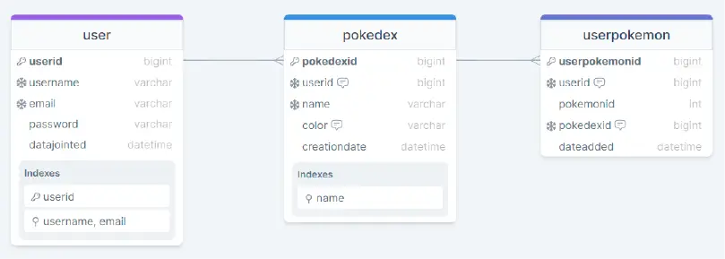
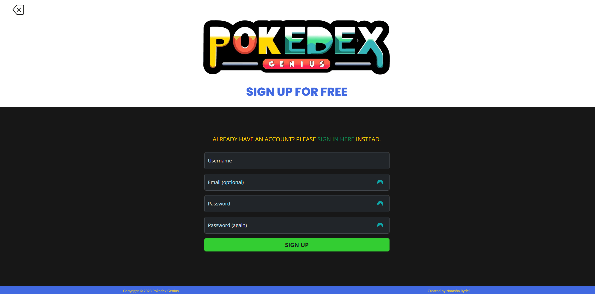
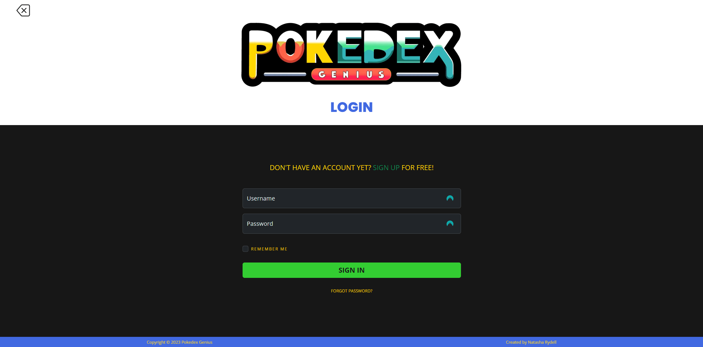
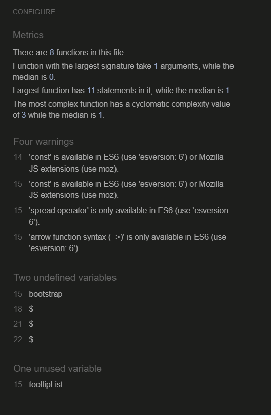

# **Pokedex Genius**
## **Site Overview**
Pokedex Genius is a web application that allows users to create, manage, and explore digital collections of Pokemon, known as Pokedexes. Users can customize their Pokedexes, add Pokemon, and engage in card-matching games. The app offers a responsive design for accessibility on various devices.

*AmIResponsive was not working when I was submitting my project.*

[Pokedex Genius will be found here.](https://pokedex-genius-9617911b5f35.herokuapp.com/)
​
## Test Account
To make it easy for you to try out all the features of Pokedex Genius without having to create your own account, you can use the following test user:

### Credentials
* **Username**: testuser
* **Password**: TestPassword123!
* **Email**: testuser@example.com

Feel free to log in with these credentials to explore the app’s functionality.\
*Note: This account is for demonstration and testing purposes only.*

## Table of contents:
1. [**Site Overview**](#site-overview)
1. [**Test Account**](#test-account)
1. [**Planning stage**](#planning-stage)
    * [*Summary of audience*](#summary-of-our-audience)
    * [*Wireframes*](#wireframes)
    * [*Color Scheme*](#color-scheme)
    * [*Typography*](#typography)
    * [*Database Models*](#database-models)
1. [**Current Features**](#current-features)
1. [**Future-Enhancements**](#future-enhancements)
1. [**Testing Phase**](#testing-phase)
1. [**Deployment**](#deployment)
    * [*Database Change: From ElephantSQL to Supabase*](#database-change-from-elephantsql-to-supabase)
    * [*Create Database*](#1-create-database)
    * [*Setting up app*](#2-setting-up-app)
    * [*Settings*](#3-settings-tab)
    * [*Deploy*](#4-display-tab)
    * [*Migration*](#5-run-migrations)
1. [**Tech**](#tech)
1. [**Credits**](#credits)
    * [*Honorable mentions*](#honorable-mentions)
    * [*General reference*](#general-reference)
    * [*Content*](#content)
    * [*Media*](#media)
​
## **Planning stage**
User stories and epics are utilized in our project to facilitate Agile development practices, enabling us to focus on delivering incremental value to users. By breaking down complex features into user stories, we can prioritize and implement them in smaller, manageable iterations, fostering collaboration and adaptability within the Agile framework. We have specified diffent users in our user stories to include all stages the user will go through.

[Link to GitHub Project](https://github.com/users/NatashaRy/projects/3)

### **Summary of our audience**
#### *Target Audiences:*
* Users who have a passion for Pokemon, e.g. Pokemon enthusiasts and collectors. 
* Users interested in engaging with Pokemon-related content in a gamified environment.
* Users who enjoy customization and creativity, looking to design and curate their own unique Pokemondexes. 
* Users are interested in the diverse world of Pokemon, including aspects of biology, strategy, and statistics in an entertaining way.
​
#### *Examples of User Stories:*
* As a user, I want to create and login to my account.
* As a user, I want to be able to create my own pokedexes and choose their colours.
* As a user, I want to be able to choose pokemons from different generations.
* As a user, I want to get some basic information about my chosen pokemons.

#### *Site Aims:*
* To provide a fun, engaging and interactive online game. 
* To be a go-to resource for Pokemon gamers.
* To provide a comprehensive Pokemon database.
* To offer an user-friendly environment with a variety of options to keep the user entertained.
​

​
### **Wireframes:**
#### *Desktop*
​

#### *Tablet*
​

#### *Mobile*
​
​
### **Color Scheme:**
​The color palette chosen for this Pokedex-themed website is not only visually striking but also strategically designed to enhance user experience and engagement. Each color has been selected for its psychological impact and functional purpose, ensuring that the website is not only delightful to interact with but also accessible and user-friendly.

#### *Color palette*
* **Tomato Red (#FF6347)**: A vibrant and energetic red, perfect for capturing attention and evoking excitement.
    * Primary usage: Link hover color, requirement astrix and alerts.

* **Gold (#FFD700)**: A bright and playful gold, adding a sense of fun and creativity.
    * Usage: Form buttons. 

* **Lime Green (#32CD32)**: A fresh and lively green, conveying growth and energy.
    * Primary usage: Primary buttons and links. 

* **Deep Sky Blue (#00BFFF)**: A clear and engaging blue, offering a sense of trust and reliability.
    * Primary usage: H1, header (gradient with Medium Orchid).

* **Medium Orchid (#BA55D3)**: A playful and imaginative purple, adding a touch of whimsy and innovation.
    * Primary usage: H2-H6, header (gradient with Deep sky blue).

* **Dark Grey (#171717)**: This dark gray offers a sleek and modern backdrop, ideal for highlighting brighter colors. Its deep tone creates a sophisticated and elegant atmosphere, enhancing the overall visual appeal of the website. 
    * Primary usage: Main background.

* **Crisp white (#FFFFFF)**: A classic and clear choice for text, offering the highest level of readability. Its purity and brightness make it an excellent choice against darker backgrounds, ensuring that text is easily legible. 
    * Primary usage: Main body text. 

Together, these colors create a visually appealing interface that prioritizes user experience. The palette is designed to be delightful to interact with while being easy on the eyes. All color combinations are tested with WebAIM AAA standards to ensure accessibility, making the website not only aesthetically pleasing but also inclusive and user-friendly. This thoughtful approach to color usage ensures that the website is engaging, functional, and accessible to a wide range of users.

​
### **Typography**

In our quest to create a space that’s as engaging and fun as it is visually appealing, we’ve carefully selected the fonts we think is the perfect fit for our brand:

#### *[Poppins](https://fonts.google.com/specimen/Poppins?query=poppins) for headings*:
* **Why:** We chose Poppins for its geometric charm and playful roundness, reflecting our commitment to a modern and friendly interface. Its semi-bold and bold styles are perfect for making our headings stand out, just like the colorful characters in our Pokedex!
* **How we use it:** Expect to see Poppins in our main titles (H1-H2) in uppercase, bringing a dynamic and energetic vibe to our platform. For subheadings (H3-H6), we mix it up with both uppercase and lowercase to keep things fresh and engaging.

#### *[Open Sans](https://fonts.google.com/specimen/Open+Sans?query=open+sans) for body text and buttons:*
* **Why:** Open Sans is the unsung hero of our text. Its clean and legible style ensures that you can dive into detailed Pokedex entries without straining your eyes. It’s the perfect complement to Poppins, maintaining balance and readability.
* **How we use it:** 
Open Sans in regular adorns our body text, input forms and button labels. We stick to standard cases for clarity in our descriptions and go for uppercase on buttons to draw your attention to the most interactive elements.

* All fonts were sourced from Google fonts, as stated in the credits.

### **Database**
Pokedex Genius uses a relational database model which includes three tables: user, pokedex, userpokemon, each described below. The database model is thoughtfully designed to support the applications core functionalites; User management, Pokedex creation and tracking user-Pokemon relationships. By integrating an external API for Pokemon data provides depth and timeliness to the application without overburdening the local database.

#### *The design explained*
* Each table serves a clear purpose making the database easy to understand and maintain.
* We use appropriate data types and unique constraints enhance performance and ensure data integrity.
* BIGINT are used for IDs allowing a large number of records, which is crucial for a growing application.
* Our structure supports a flexible and rich user experience where users can manage multiple Pokemondexes and Pokemons.

#### *Data tables explained*
* **User table:** Stores essential user information. 
Manages user authentication and profile information. Username and email are unique for individual identification and login purposes.

* **Pokedex table:** Represents a collection of Pokemon for each user. 
Allows the user to create multiple, uniquely named Pokedexes and choose a color for each. 
Userid is used as a foreign key linking to the user table.  

* **Userpokemon table:** Manage the relationship between users and their Pokemon.
Tracks  which Pokemon are added to each Pokedex and by which user.
UserID and PokemonID may form a composite key if a Pokemon can only appear once per
User.

#### *Relationships explained*
* **User → Pokedex:** One-to-Many relationship. A user can have multiple Pokedexes but each Pokedex is associated with only one user. 
* **Pokedex → Userpokemon:** One-to-Many relationship. A Pokedex can contain many userpokemon, linking the selected Pokemon to the Pokedex.

#### *Usage of API*
We have chosen to use PokeAPI to fetch dynamic comprehensive data about Pokemons without storing all of the Pokemon data locally.The application can retrieve detailed information on-demand from the API when needed. 

**Benefits of using PokeAPI:** 
* By not storing all Pokemon details, instead include fields to store identifiers/keys that reference data in the API we can ensure the database will be kept lean and manageable. 
* As the user base grows the API can handle the load of fetching POkemon data, reducing the strain on the local database.
* Helps us ensure that the Pokemon data provided is fresh, since the application always has access to the most current data without needing local updates. 
* Let us focus on user-related data management while leveraging a pool of data from the API for everything Pokemon related. 

​
## **Current Features**

#### *Navigation Bar*

* The header element contains the site navigation which provides direct links to each section of the page, ensuring users can quickly jump to the content they're interested in.
* The navigation bar is stiyck, which let the user easily navigate around the page without having to scroll to the top each time.
* Each navigation option is presented in a clear, readable font and style, ensuring users can easily identify where they want to go.
* The site logotype helps users instantly recognize and identify the brand.

* Provides a dropdown navigation menu for account related links

* Provides a dropdown navigation menu for Pokedex related links
* Created Pokedexes are added dynamic

##### *Mobile navigation*

* Navigation used for smaller screens.
* Menu opens above everything on the page.

##### *Start page*

* Let user create account

##### *Sign up account*

* Let user create account

##### *Login*

* The users can easily login to their account.
* Has remember me function.
* If user is logged in when visiting the site, they will automaticlly be redirected to the dashboard.

##### *Password reset*

* The users can easily reset the password to their account if it is forgotten.
* An email will be sent to the user.

#### **General pages**

##### *Dashboard page*

* Gives the user an overall created Pokedexes.
* Is empty if no Pokedexes are created.

##### *Search page*

* Let the user find Pokemon
* Has a dropdown list to display all Pokemon fetch from through the API

### **Account pages**

##### *Account*

* The user can easily see their account information.
* The user can see their pokemon trainer id, if added.

##### *Account settings*

* The user can easily change their account information.
* The user can add their pokemon trainer id.

##### *Change password*

* The users can easily change password.

### **Pokedex**

##### *Pokedex*

##### *Creating Pokedex*

* User adds a name, description (optional) and chooses the colour of the Pokedex.
* User can make Pokedex favorite

##### *Edit Pokedex*

* User adds a name, description (optional) and chooses the colour of the Pokedex.
* User can add/remove Pokedex as favorite

##### *Delete Pokedex*

* User have to confirm deletion of Pokedex.

### **Pokemon**

##### *Pokemon*

* Gives details about chosen Pokemon.
* Let user add Pokemon to Pokedex.
* Provides explanations for abbreviations

##### *Delete Pokedex*

* User have to confirm deletion of Pokedex.

​
## **Future-Enhancements**
​
* Build more of a community where users can interact and engage with each other and see their profiles. 
* Let users vote on and save other users' Pokemondexes. 
* Display a scoreboard of the best ranked (the one with most votes during a specific time range) Pokemondexes.

​
## **Testing Phase**
​Browsers Tested:
* Google Chrome
* Mozilla Firefox
* Microsoft Edge

Tablet Tested:
* Apple iPad Air (4th gen) - Google Chrome, Safari
* Samsung Galaxy A7 - Google Chrome

Mobile Phones Tested:
* Samsung Galaxy S22 Ultra - Google Chrome
* Samsung Galaxy A54 - Google Chrome
* OnePlus 9 Pro - Mozilla Firefox
​
### **Responsiveness**
We have tested the responsiveness of the site in several browsers and devices, listed above, to ensure cross-compatibility which will provide the expected user experience. Responsiveness has been tested using DevTools for each browser, both on chosen dimensions and by making the window smaller.

We have tested the sites responsiveness with Dev Tools in the following ways:
* Live simulation of the site through VS Code.
* Published page on GitHub.

Ways we have used Dev Tools to test responsiveness:
* Narrowed the screen when opening Dev Tools.
* Checked different devices and dimensions.
​
### **Functionality **
#### *User-Related Operations Testing*
* **Create User:**
    * Go to the registration page.
    * Fill in valid user registration details (username, email, password).
    * Click the "Register" button.
    * Expected Result: A new user account is created successfully, and the user is redirected to the login page.

* **Edit User Profile:**
    * Log in with a user account.
    * Navigate to the user profile editing page.
    * Update user profile information (e.g., first name, last name, email).
    * Click the "Save" or "Update" button.
    * Expected Result: User profile information is updated successfully, and the changes are reflected in the profile.

* **Delete User Account:**
    * Log in with a user account.
    * Go to the account settings or delete account page.
    * Confirm the deletion by providing the necessary credentials or confirmation.
    * Click the "Delete Account" button.
    * Expected Result: The user account is deleted, and the user is redirected to the registration page.

#### *Pokedex-Related Operations Testing*

* **Create Pokedex:**
    * Log in with a user account.
    * Navigate to the "Create Pokedex" page.
    * Fill in the required information (e.g., Pokedex name, description).
    * Upload a cover image (if applicable).
    * Click the "Create Pokedex" button.
    * Expected Result: A new Pokedex is created and associated with the user account, and the user is redirected to the Pokedex details page.

* **Edit Pokedex Details:**
    * Log in with a user account.
    * Go to the Pokedex details page for a specific Pokedex.
    * Click the "Edit" or "Update" button.
    * Modify the Pokedex details (e.g., change name, description, cover image).
    * Click the "Save" or "Update" button.
    * Expected Result: The Pokedex details are updated, and the changes are reflected in the Pokedex details page.

* **Delete Pokedex:**
    * Log in with a user account.
    * Go to the Pokedex details page for a specific Pokedex.
    * Click the "Delete" button.
    * Confirm the deletion by providing the necessary credentials or confirmation.
    * Click the "Delete Pokedex" button.
    * Expected Result: The selected Pokedex is deleted, and the user is redirected to their list of Pokedexes.

#### *Pokemon-Related Operations Testing*

* **Add Pokemon to Pokedex:**
    * Log in with a user account.
    * Go to the Pokedex details page for a specific Pokedex.
    * Click the "Add Pokemon" or "Add to Pokedex" button.
    * Search for a Pokemon by name or other criteria.
    * Select a Pokemon from the search results.
    * Click the "Add" or "Save" button.
    * Expected Result: The selected Pokemon is added to the Pokedex, and it appears in the Pokedex's list of Pokemon.

* **Edit Pokemon Details:**
    * Log in with a user account.
    * Go to the Pokedex details page for a specific Pokedex.
    * Select a Pokemon from the list.
    * Click the "Edit" or "Update" button next to the Pokemon.
    * Modify the Pokemon's details (e.g., change name, type, abilities).
    * Click the "Save" or "Update" button.
    * Expected Result: The Pokemon's details are updated, and the changes are reflected in the Pokedex.

* **Remove Pokemon from Pokedex:**
    * Log in with a user account.
    * Go to the Pokedex details page for a specific Pokedex.
    * Select a Pokemon from the list.
    * Click the "Remove" or "Delete" button next to the Pokemon.
    * Confirm the removal by providing the necessary credentials or confirmation.
    * Click the "Remove from Pokedex" or "Delete Pokemon" button.
    * Expected Result: The selected Pokemon is removed from the Pokedex, and it no longer appears in the Pokedex's list of Pokemon.
​
### **Validators**
Due to lack of time and poor time management we did not have time to resolve all problems we found when validation were made. 

​
​
## **Bugs**
​
We always have bugs in development, a few bullet points here to talk about bugs you found and how you fixed them, in later projects this will be more detailed
​
### *During development*
1. Issue: When the user fills the login form with invalid information, the form clears.
    * Cause: This could be due to how the form is being handled in the view.
    * Resolution: Ensure that the form is rendered correctly in the template and that form validation errors are properly handled in the view. Make sure you are not resetting the form data on invalid submissions.

2. Issue - When user tries to select Pokemon the redirection is not working
    * Issue 2: TypeError: PokemonDropdown.__init__() got multiple values for argument 'choices'
    * Cause - Invalid form.
    * Resolution - By adding debugging `search` in the pokedex views.py, we could see the form was not valid. Trying to fix the invaild form we got an new error (issue 2). We solved the problem by adding an if-statment to the `request.method == 'POST'`to explicity specifiy to pass the `'POST'` data, else pass the choices, which resolved both our problems with the form and redirect to the chosen Pokemons details.

3. Issue: When the user fills the login form with invalid information, the form clears.
    * Cause: This could be due to how the form is being handled in the view.
    * Resolution: Ensure that the form is rendered correctly in the template and that form validation errors are properly handled in the view. Make sure you are not resetting the form data on invalid submissions.

4.  Issue: When a user tries to select a Pokemon, the redirection is not working.
    * Cause: This could be caused by an invalid form or issues in the view function.
    * Resolution: Debug the form to ensure it is valid. Additionally, check the view function for any errors or issues with how the redirection is implemented. 

5.  Issue: Error message when updating profile information.
    * Cause: There could be various causes for this, such as incorrect form data or validation errors.
    * Resolution: Inspect the error message to identify the specific issue. Ensure that form data is correctly validated, and error messages are displayed appropriately in the template.

6. Issue: Pokedex dropdown menu not appearing.
    * Cause: This could be due to HTML or template-related issues.
    * Resolution: Check the template to ensure that the dropdown menu is properly included and that any JavaScript or CSS required for its functionality is included.

7. Issue: User could create a Pokedex even if an error occurred.
    * Cause: Error handling in the view may not be properly implemented.
    * Resolution: Implement proper error handling in the view to prevent the creation of a Pokedex if an error occurs during the creation process. This may involve rolling back transactions or displaying appropriate error messages.

8. Issue: When a Pokemon is added to the Pokedex, another Pokemon is displayed in the Pokedex.
    * Cause: This could be due to incorrect logic in the view or database interactions.
    * Resolution: Review the logic in the view that adds Pokemon to the Pokedex and ensure that it correctly associates the selected Pokemon with the Pokedex.

9.  Issue: Confirmation of password resetting without an existing email address.
    * Cause: This may be related to how password reset requests are handled.
    * Resolution: Validate that the email address exists in the system before confirming a password reset. Ensure that appropriate error messages are displayed if the email address is not found.

10. Issue: Favorite Pokedex.
    * Cause: The behavior of marking a Pokedex as a favorite may not be implemented correctly.
    * Resolution: Review the code responsible for marking a Pokedex as a favorite and ensure that it correctly updates the database and user interface.

11. Issue: Display "None" instead of Pokemon's name.
    * Cause: This issue could be related to how data is retrieved from the database.
    * Resolution: Check the database records for any entries with missing or incorrect names. Ensure that the data retrieval and display logic correctly handles cases where the name is missing.

12. Issue: Pokedex cover image uploaded by the user is not displayed.
    * Cause: There may be issues with how the uploaded images are stored or retrieved.
    * Resolution: We have not found a resolution to this problem yet. So our temporary solution is not to let the user upload any images on their own. 
​

***
## **Deployment**
This project was deployed to Heroku through the following process:

Settings.py: DEGBUG = False

### **Database Change: From ElephantSQL to Supabase**
> **Important**:\
> As of 2024, ElephantSQL has discontinued its free database hosting.\
> Pokedex Genius now uses **[Supabase](https://supabase.com)**

- All data and migrations are now handled via Supabase.
- If you see references to ElephantSQL in older documentation, these are now replaced by Supabase.
- The app works as before, but with a new, modern database backend. 

### **1. Create database**
#### **ElephantSQL** (Old)
1. ~~Log in to [elephantsql.com](https://elephantsql.com)~~
2. ~~Clicked the button labelled **"Create new database"** on the dashboard in the top right corner above the instances.~~
3. ~~Entered a name, we chose **"db-pokedex-genius"** from the dropdown menu.~~
4. ~~Then chose plan, we chose **"Tiny turtle"**.~~
5. ~~Choosing a region, we chose Europe since it is the most relevant.~~
6. ~~Click button to **"Create app"**.~~

#### **Supabase** (Current)
1. Go to [supabase.com](https://supabase.com) and sign up/log in.
2. Click **New project** and fill in the required details (project name, password, region).
3. Once the project is created, click on **Connect** in the project header. 
4. Copy the `DATABASE_URL` found under **Connection String**.
5. Save the URL for later. 

### **2. Setting up app**
1. Log in to [Heroku.com](https://heroku.com)
2. Clicked the button labelled **"New"** on the dashboard in the top right corner under the profile picture.
3. Choosing **"Create new app"** from the dropdown menu.
4. Enter a **unique** name, we chose ***pokedex-genius***.
5. Choosing a region, we chose Europe since it is the most relevant.
6. Click button labelled **"Create app"** and come to the projects **"Deploy"** tab.

### **3. Settings tab**
7. Click the **"Settings"** tab and navigate to **"config Vars"** section.
8. Add:
* **`DATABASE_URL`** as key and **`link to database url`** as value, then clicked **"add"**.
* **`PORT`** as key and **`8000`** as value, then clicked **"add"**.
* **`SECRET_KEY`** as key and **`secret key`** as value, then clicked **"add"**.
9. Scroll down to **"Buildpacks"** section, clicking **"Add buildpack"** and then selection **"Python"**.
10. Repeating the process above but adding **"Node.js"** instead of "Python".

### **4. Display tab**
11. Click **"Deploy"** in the tabs menu.
12. Chose **GitHub** as **"Deployment method"**.
13. Confirm connection. 
14. Search for the repository name and click **"Connect"**. 
15. Chose **"Automatic deploys"** or **"Manual deploys"**.

### **5. Run migrations**
- After deployment, run: `heroku run python manage.py migrate`
- (You may also want to create a superuser)

Final deployment is found [here](https://pokedex-genius-9617911b5f35.herokuapp.com/).
​
## **Tech**
- HTML
- CSS
- Python
- Bootstrap
​
## **Credits**
### **Honorable mentions**
​* Richard Wells, my mentor, who is always very supportive and helpful. This project would not be possible without his help, so a very big thanks to him.​
* Big thanks to my family who have great patience and are always supportive.
​
### **Content:**
* Poppins and Open Sans fonts from [Google Fonts](https://fonts.google.com/specimen/Open+Sans?query=open+sans) 
* Bubbles background pattern from [Hero Patterns](https://heropatterns.com/)
* We have used [Bootstrap](https://getbootstrap.com)
* For some forms we have used [Crispy forms](https://django-crispy-forms.readthedocs.io/en/latest/)

### **General references:**
* All code is written by myself. 
* I have used [ChatGPT](https://openai.com) when I got stuck and could not figure out how to get forward. I have not asked ChatGPT to write code for me without contributing my own code to be fixed. 
  
### **Media:**
* Logotype, color palette, typography and placeholders are created by myself using [Adobe Illustrator](https://www.adobe.com/se/products/illustrator)​
* Wireframes are created by myself using [Adobe XD](https://helpx.adobe.com/se/xd/get-started.html)​
* Icons from [Font Awesome](https://fontawesome.com/)
* Images compressed with [TinyPNG](https://tinypng.com/)
